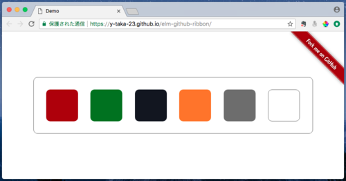

GitHub Ribbons for Elm ([Try It](https://y-taka-23.github.io/elm-github-ribbon/))
=================================================================================

Show the "Fork me on GitHub" ribbon in your Elm app.



Usage
-----

```elm
view : Model -> Html Msg
view m =
    div []
        [ ribbon
            { owner = "y-taka-23", repo = "elm-github-ribbon" }
            { position = Right, color = Red }
        , ...
        ]
```

For more programmatic examples, see [the demo page](https://y-taka-23.github.io/elm-github-ribbon/).
